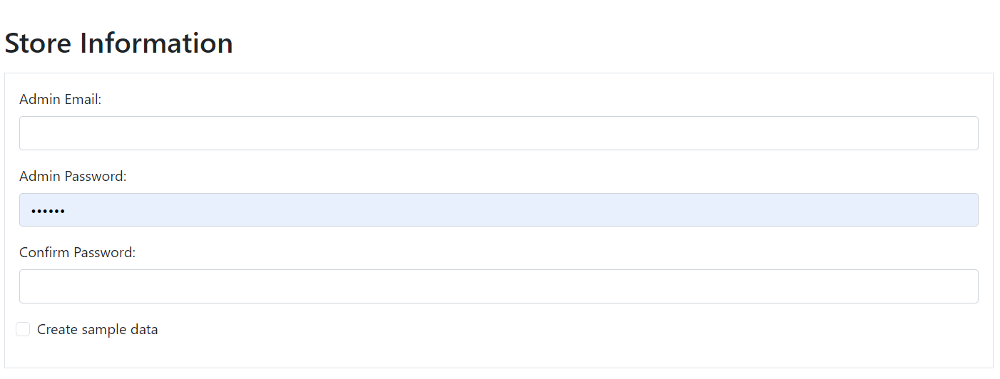
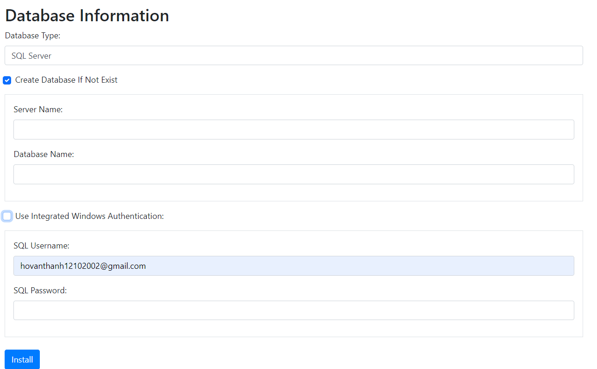

# TCommerce

- Dự án thương mại điện tử sử dụng ASP.NET Core MVC và ASP.NET Core Web API.


## Tổng quan
- Dự án này là một ứng dụng thương mại điện tử nhỏ của một sinh viên mới ra trường (tôi) được xây dựng để nâng cao kỹ năng lập trình.
- Hầu hết mọi ý tưởng dự án của tôi đều dựa vào [nopCommerce](https://github.com/nopSolutions/nopCommerce) để làm.
## Yêu Cầu

- [ASP.NET Core 7](https://dotnet.microsoft.com/download/dotnet/7.0)
- [Visual Studio 2019 hoặc 2022](https://visualstudio.microsoft.com/vs/)
- [Microsoft SQL Server 2019 hoặc 2022](https://www.microsoft.com/en-us/sql-server/sql-server-downloads)


## Hướng dẫn cài đặt
1. Clone dự án từ GitHub:

    ```bash
    git clone https://github.com/thanhhvxqt/TCommerce-Mvc.git
    ```

2. Mở solution trong VS2019 hoặc VS2022.
3. Chạy lệnh sau để cài đặt các gói NuGet:

    ```bash
    dotnet restore
    ```
4. Build dự án (Ctrl + Shift + B) và config VS2019 hoặc VS2022 chạy 2 project T.Web và T.WebApi (hoặc bạn có thể làm cách nào đó khác để chạy 2 project này. Bắt buộc phải chạy 2 project này trong lần đầu).
5. Run dự án với phím F5 hoặc Ctrl + F5
6. Điền thông tin


